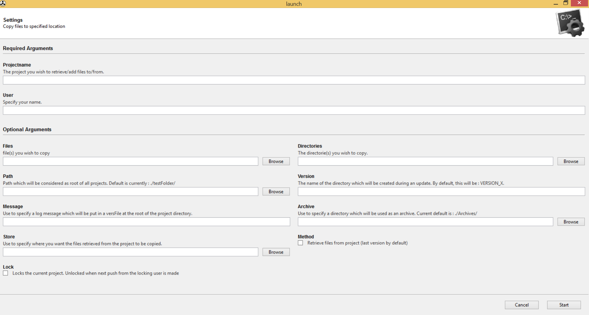

# SmallVersionningPythonScript
(optional)
## Description
A small utility script that allows basic project versionning functionnalities (I.e : Copy to and from source/dest folders, "versionning" of revisions, "archiving"... Etc.

## Requirements
This program uses python 2.7 64 bit for windows. 
It also makes use of a few python modules :
  - WXPython 
      - http://sourceforge.net/projects/wxpython/files/wxPython/3.0.2.0/wxPython3.0-win64-3.0.2.0-py27.exe/download?use_mirror=iweb
  - Gooey (Beta)
      - git clone https://github.com/chriskiehl/Gooey.git then run a `python setup.py install` from inside gooey's directory
      
      OR
      - `pip install gooey`

  - Shutil (Should be included with a default version of python)
  - argparse
      - `pip install argparse`

##Usage
As of now, it is still a commandline launched application. Go to the root directory of the project, and just type `python launch.py` That will launch the script and give you a GUI to supply the arguments.

The first two arguments are mandatory. 
ProjectName should be the name you want your projects main folder to have. Inside of said folder will be your different versions of the project.

User should be the name you will (always) use with this script. This is what will be used to know who you are and wh
